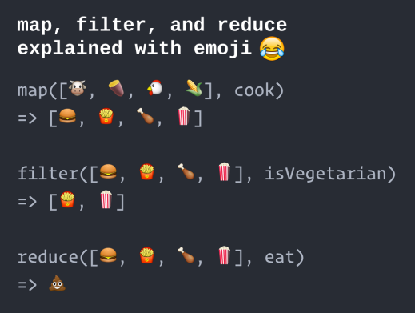

# Programación funcional 

Funcion de orden superiror n.n, programaciín expresiva

Es un viejo conocido del mundo del desarrollo, pero en los últimos años está cogiendo tracción gracias a la emergencia de arquitecturas reactivas, el uso de esquemas funcionales en Big Data y el creciente soporte en diversas plataformas de desarrollo.

js es un lenguaje multi paradigma pero tiene fuerte tendencia a la programación funcional.

JavaScript ha sido siempre un lenguaje con fuerte tendencia al diseño funcional y desde el surgimiento de Node.js y la filosofia de los paquetes NPM, este paradigma es uno de los más importantes en el lenguaje.

## Funciones 

Abstraer el control de flujo y las opereaciones de una aplicación.

Evitar efectos secundarios por estados globales y mutables.

Uso de caso es la ejecución de un operador ternario.

**No se trabaja** con estados globales o mutables.

## Ayuda en:

* Escribir código más expresivo.
* Crear aplicaciones más limpias, modulares y testeables
* Cometer menos errores
* Protegernos del propio JavaScript (evitar eñ scope globa, context,)

**Beneficios**

* Alienta a la descomposición de tareas complejas
* Permite procesar datos con un flujo encadenado
* Disminuye la complejidad del código dirigido por eventos.

Flujos encadenados, es como el principio de las promesas. Punto y algo, punto y algo.

Declaración de programación funcional es flujo encadenado.

**Se basa en**

* Programación Declarativa
* Funciones Puras
* Transparencia Referencial
* Inmutabilidad

## Programacion declarativa

La PF se encuentra dentro del cunjunto de los lenguajes declarativos.

La programación declarativa se basa en indicar el qué debe hacer a diferencia de la programación imperativa donde se indica el cómo.

Se centra en el uso de **expresiones** para describir la lógica de un programa sin tener que especificar el flujo o los cambios de estados que se producen, eso se delega en una función.

De esta forma obtendremos un código de primer nivel encargado de ir expresando qué necesita hacer.

Las funciones el lenguaje nos las da, o incluso las podemos construir c:

## Funciones puras

Son funciones que se declaran con matematica pura y se basa en construir codigo inmutable.

Cuando un valor entra a una funcion ya no tenga manera de cambiar.

Se caracterizan por dos cosas: 

* Depender sólo de los parámetros de entrada proporcionados y no de ningún estado externo a la función que podría cambiar durante la evaluación o entre llamadas.

* No inflije cambios más allá de sus ámbito. Por lo tanto, no tiene que modificar estados globales, ni estados que han pasado por referencia.

**Nos Ayuda**:

Nos ayuda a cometer menos errores y a verificar en todo momento como es el estado antes y después de ejecutar la función.

Evitar este tipo de uso, hará que nuestro código sea más robusto y fácil de testear.

**Casos que prdrían causar efectos secundarios:**

* Cambiar una variable u objeto global.
* Cambiar el valor original del argumento de una función (valores por defecto en una función).
* Procesar datos de entrada del usuario.
* Lanzar excepciones. (try catch)
* Mostrar datos por pantalla.
* Consultar el DOM, las cookies o una base de datos.

Muchos de estos efectos secundarios no se pueden evitar, al acceder a aplicaciones reales. Sin embargo, la PF nos ayudará a delimitar y detectar estos casos para que produzcan el menor daño posible.

## Tranparencia referencial

Es una característica basica de las funciones puras, no depende de factores externos.

Una función es **referencialmente transparente** si de manera consistente devuelve los mismo resultados con los mismos datos de entrada.

Si recibo una cadena, devuelvo una cadena :1 !!!!

Si la función depende de estados externos, es complicado que dado unos valores de entrada, siempre devuelva los mismos resultados de salida ya que en el camino, todas esas dependencias pueden cambiar el comportamiento de la funcions

## Inmutabilidad

El mayor número de errores en una apliación se produce por un mal control de estos estados.

Que un estado pueda cambiar puede hacer que no obtengamos lo esperado

Por lo tanto controlar los cambios de estados en elas aplicaciones es primordial.

Lo  único que podemos hacer es reducir el número de estados a los indispensables e intentar que sean inmutables.

**Tipos inmutables**

En JavaScript los tipos simples como String, Number o Boolean son tipos inmutables. Cuando se modifica un estado se genera una nueva referencia del dato en memoria.

Sin embargo, los Arrays y los Objetos son mutables. La referencia a su memoria siempre es la misma, si modificamos un atributo o un elemento el puntero continua.

**Recursividad**

Es una técnica en programación para solucionar problemas complejos que puedene dividirse en partes más pequeñas e idénticas al problema total pero no menor magnitud. Nos ayuda a controlar el flujo de datos, casos o numero de veces necesarias para el resultado final.

Evita el uso de iteraciones.

Se lleva muy bien con estructuras de datos que partan de un nodo raiz y del que vayan colgando diferentes nodos hijos como los Arreglos y los Objetos.

La composición de todas las soluciones hijas dan el resultado de la solución padre.

1. Un caso base
2. Un caso recursivo

**Caso Base**

Es el caso al que toda función recursiva tiene que acabar llegando para dar por resuleto el caso más simple del problema que se quiere resolver.

Si no definimos un caso base dentro de nuestra solución recursiva se creará un funciones infinitas.

**Caso Recursivo**

Suele ser una función que es capaz de autoinvocarse

La clave de esta autoinvocación es que los elementos que le pasemos tendrán que ser menores que los del problema padre ya que si no nunca podríamos llegar al caso base.

## Metodos funcionales 

* Cumplen con todas las características funcionales
* Son de orden superior
* Se pueden encadenar
* Necesita una expresión *lambda =>* 
* Permiten:
    
      Abstraerel control de flujo de la lógica de negocio
      Evita el uso de bucles e iteraciones
      Tienen ámbito de bloque  

Funciones y objetos

**reduce**: Reune resultados. Se usa como acumulador de resultados, espera una expresión que cuente con un parámetro acumulador y el elemento en el que se encuentra el iterador. Lo que devuelve es el valor acumulado.

Se comporta parecido unn 'GROUP BY' de SQL

**map**: Transforma datos. Recorre un array de elementos y transforma sus datos por medio de una funcion.

Recibe una expresión como parámetro que realiza la transformación.

**filter**: Elimina datos no deseados. Espera una expresión que indique si el elemento en el que se encuentra es deseado o no.

Ideal para hacer búsquedas en un array.

Se comporta parecido a un 'WHERE' de SQL

## PROGRAMACION FUNCIONAL
* Aquitecturas centradas en la transformación
* Variantes funcionales
* Inmutabilidad
* Transparencia Referencial (no elementos externos)
* Compositividad (un problema en pequeños)
* Arquitecturas dirigidas por flujos de datos (Me interesa el que y no el como)

## PROGRAMCIÓN ORIENTADA A OBJETOS
* Puntos de Extensión Polimŕfica (herencia)
* Arquitecturas centradas en la abstracción
* Sustentavidad Liskoviana
* Encapsulación de estado
* Arquitectura dirigidas por flujo de control

**operador corto circuito** es para simplificar el operador ternario

OR - Cuando el valorde la izquierda en la expresión siempre pueda validar a true, es el valor que se cargará por defecto.

AND - cuando el valor de la izquierda en al expresión siempre pueda validar a false, es el valor que se cargará por defecto.

## Conclusión

La programación Funcional es un paradigma que usa la sinxis declarativa de funciones puras para que crear programas inmutables que eviten efectos secundarios que sean observados externamente, puede convivir con otros paradigmas como la Orientación a Objetos.

**Cosas en el tintero**

Trnsductores, aridad, tuplas, currificaciones, funtores, combinadores, memorización, mónadas.